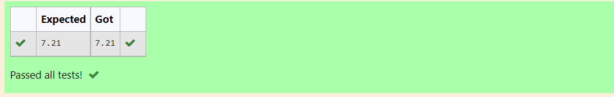

# DISTANCE-BETWEEN-TWO-POINTS

## AIM:
To write a python program to find the distance two 2 points
## ALGORITHM:
### Step 1: 
Import math module 
### Step 2:
Assign the give values according to the given formula
### Step 3: 
Substitute the values in the distance formula  
### Step 4: 
Print the distance
### Step 5: 
End the program
### PROGRAM:
~~~
import math
x2,x1,y2,y1=10,4,6,2
a=((x2-x1)**2)+((y2-y1)**2)
d=math.sqrt(a)
print(format(d,".2f"))
~~~
  
### OUTPUT:

### RESULT:
